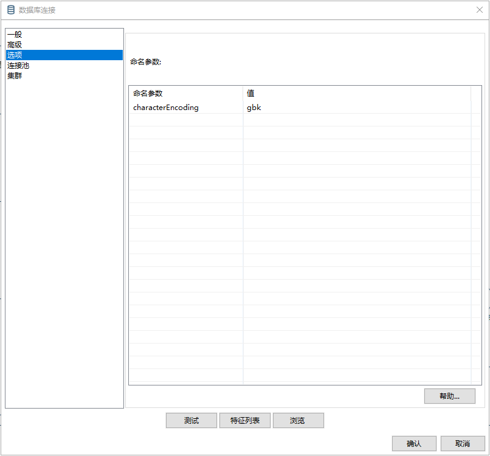
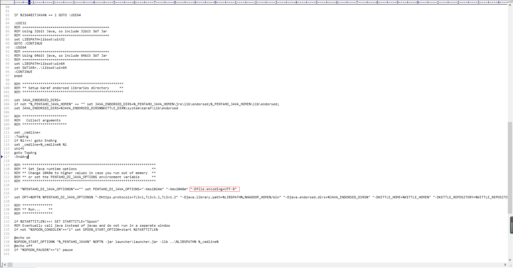

# 【ETL】Kettle 字符编码问题

## Kettle 保存文件时提示错误？

一般这种问题是因为数据库连接与数据库字符编码不一致导致的，需指定数据库连接字符编码与数据库一致【Repository Manager】->【数据库连接】->【选项】->【命名参数：characterEncoding；值：数据库编码（如：gbk）

## 打开转换时提示【一个数据库错误发生在从资源库文件读取转换时 Unexpected error reading step information from the repository Invalid byte 1 of 1-byte UTF-8 sequence.】

一般发生在 Windows 系统，需要修改 Spoon.bat 中 JVM 参数【-Dfile.encoding=UTF-8】

